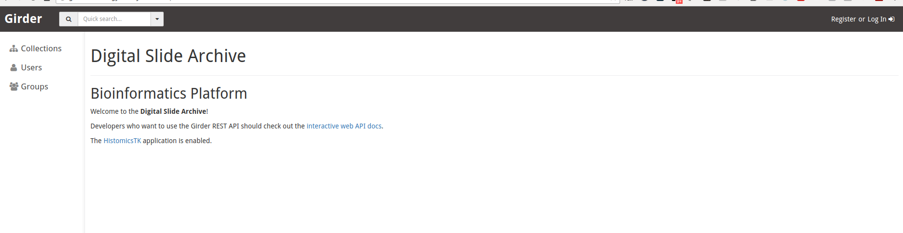
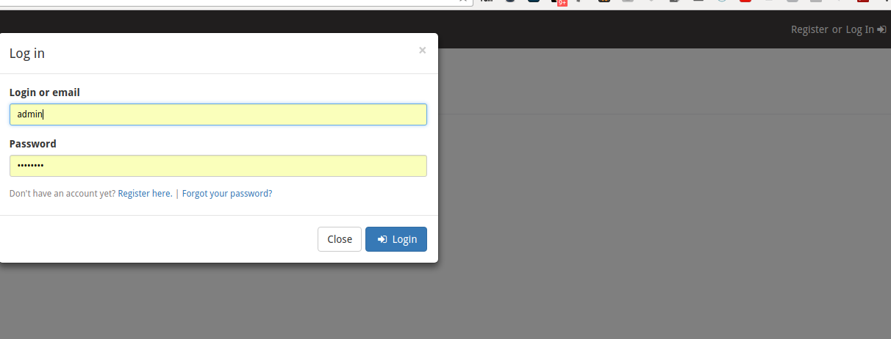
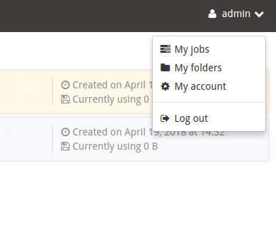
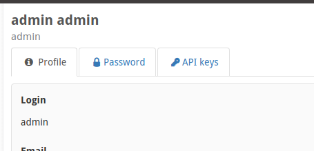
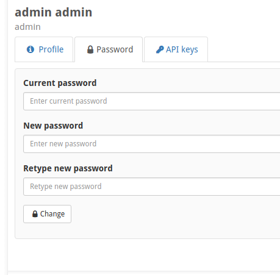
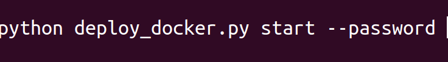
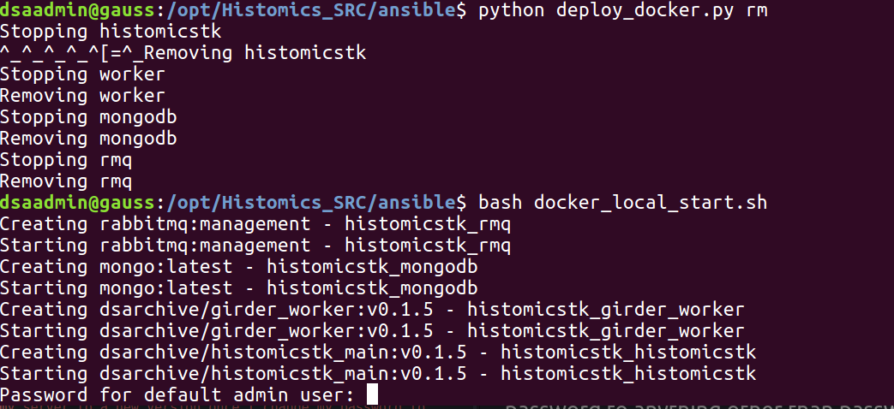

## Logging in the first time

So by default, the DSA will be running on port 8080 of your server (although you can change this if you want to).

#### TO DO:  ADd link showing changing startup port

So you should go to http://myserverIPAddress:8080/

So if you click on the upper right corner, you should see Register or Login, by default it creates an admin account with admin/password is the userID/password...

Now you probably want to change the default password to anything else... but remember that when you change the admin password, you need to modify your startup script to let it know your not using the default password... it will prompt you to enter it during any updates/syncs... so first things first... let's change our password.

In the right hand corner click admin and then My account..

You should then see a page similar to above, click on the password tab, and like almost every web site you've ever used, type in your current password, and new password twice..

Once you click change, a note in the upper right corner should let you know it worked.  

## Updating my server to a new version once I change my password to anything other than password...

~~~~~
cd /opt/Histomics_SRC/ansible
nano docker_local_start.sh # i.e. edit the docker_local_start file
python deploy_docker.py rm  
bash docker_local_start.sh
~~~~~

This time when I run my script to start docker, it pauses and asks me for the admin password...so I type it in, and it continues.... and then about 20 seconds later the server is back up and running.
