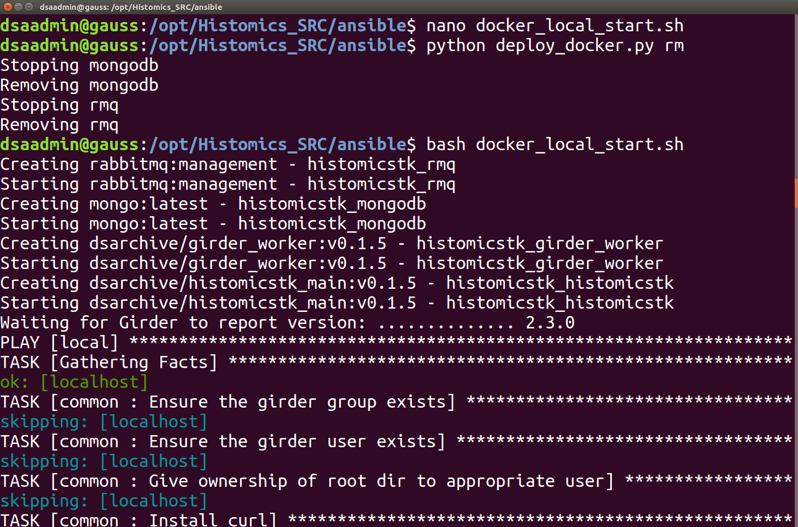
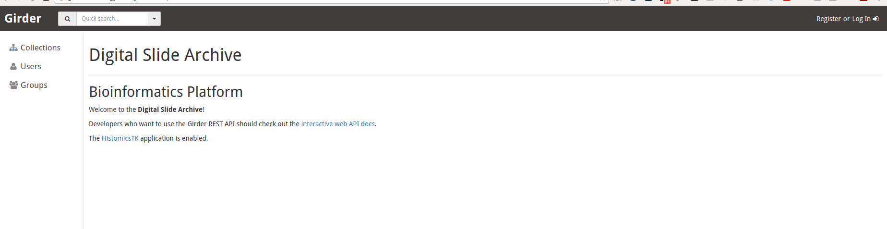

## Installation Guide for a Digital Slide Archive Instance

### Installation Requirements:

1) Root access  
2) Ubuntu 16.04 Machine (although very likely other platworks will work, testing coming as requested)

### Further notes on Installation

All of the scripts needed for installation are available on the main HistomicsTK
website ( add git link).  We are using Dockerized containers which should make
simpler and faster.  Thism won't require building the entire software stack,
as they are prebuilt when you pull them from Docker Hub.  

### Step 1

We recommend upgrading the system.


## TO DO: Fix this image!


```sudo apt-get update && sudo apt-get upgrade```

I created a default username (dsaadmin) during my initial installation with sudo access.  

```bash
sudo useradd dsaadmin
sudo passwd dsaadmin
##Type in password for dsaadmin
sudo usermod -a -G sudo dsaadmin```

You then want to logout and log in as the dsaadmin usermod


### Step 2
Install Docker:  These instructions assume your using Ubuntu 16.04.

```bash
sudo apt-get install docker.io python-pip
sudo apt-get install build-essential libssl-dev libffi-dev python-dev
sudo pip install --upgrade pip
```

### Now that we have pip, need to install docker-py and ansible into user space
```bash
pip install docker-py ansible --user
```

## Please note, you need to be a member of the docker group in order to check the status of docker containers; also you have to LOG OFF and then LOG BACK IN after adding the admin user to the docker group in order for the permissions to be properly updated

~~~
sudo usermod -a -G docker dsaadmin
logout
~~~

Check and see if docker is running...
~~~~
docker ps
~~~~


The docker containers are actually running, but the current user (dagutman) doesn't
have access to connect to the docker containers.

~~~~
sudo usermod -a -G docker dsaadmin
exit
~~~~

Now Login again as dsaadmin and run the command
`docker ps`

### Now clone the Histomics Repo
We have opt'ed (pun intended) to install the Histomics/Girder installation into the /opt directory on our system
Please note it's important to make sure the dsaadmin user had the proper permissions to read/write into whatever
directories you create for these installation files

~~~~
cd /opt
sudo mkdir /opt/Histomics_SRC
sudo chown dsaadmin:dsaadmin Histomics_SRC

#now clone the repo
git clone https://github.com/DigitalSlideArchive/HistomicsTK.git Histomics_SRC/

cd Histomics_SRC
cd ansible
~~~~

To get information on how to install Histomics, there's a deploy_docker.py in the
ansible directory.  This helper script allows you to pull the latest histomicsTK images, and stop and start all the associated docker containers

~~~~
python deploy_docker.py --help
~~~~
assets/DSA_Installation-95e35.png

#### Actually pull the doecker containers
~~~~
python deploy_docker.py pull
~~~~

### Starting DSA for the first time

Once the images are pulled, you can simply Type
~~~~
python deploy_docker.py start
~~~~


### Where's my stuff being stored??
So by default, when you start a new DSA/Girder instance it will create the following directories.

assetstore -> Where girder stores items/files/"stuff" that I've uploaded  
db --> where the mongoDB lives; mongo is running in a container so it needs to have a persistent location where the data is stored and can be backed up  
logs --> logs/errors/etc. get placed here


So I prefer to specify where the logs, mongo database, and assetstores (storage space the DSA uses for files/items) live on my file system.  By default it will create all of this for you in

~/.histomics so in our case if I look in
/home/dsaadmin/.histomicstk


The Mongo Database should be stored in a directory outside of the actual docker
container, as an example I am storing it in /opt/MONGO_LOCAL

sudo mkdir /opt/MONGO_LOCAL
sudo chown dsaadmin /opt/MONGO_LOCAL
mkdir /opt/MONGO_LOCAL/logs

## The log directories will be stored in /opt/Histomics_DATA/logs useful for debugging

~~~
sudo mkdir /opt/Histomics_DATA
sudo chmod g+s /opt/Histomics_DATA
sudo chown dsaadmin /opt/Histomics_DATA
~~~

## Create assetstore directory

~~~
sudo mkdir /opt/LOCAL_ASSETSTORE  
sudo chown dsaadmin /opt/LOCAL_ASSETSTORE
mkdir /opt/LOCAL_ASSETSTORE/girderAssetStore
~~~

## Create a directory for Mongo
sudo mkdir /opt/MONGO_LOCAL
sudo chown dsaadmin /opt/MONGO_LOCAL
mkdir /opt/MONGO_LOCAL/girder_db  

### Default User and password
on initial creation, the userid=admin and password=password
Obviously, this is not very secure.  So we <i>strongly</i> recommend you change
this as follows

However, when you do this, you must also specify the user ID and password when
you do any upgrades to the main docker image.

assets/DSA_Installation-694b1.png

## Creating a start up script
So in my use case, I am overriding the default directories girder tries to put "stuff";  so I wrote a one line bash script that will start the DSA, so below is the simplest script, I am calling it docker_local_start.sh and placing it on /opt/Histomics_SRC/ansible

python deploy_docker.py start --db=/opt/MONGO_LOCAL/girder_db --assetstore=/opt/LOCAL_ASSETSTORE/girderAssetStore --logs=/opt/Histomics_DATA/logs


## Stopping/starting/updating docker

So I had already started my DSA instance before, but was using the default locations; so first thing I need to do is stop the version that's running.

~~~~~
python deploy_docker.py stop
python deploy_docker.py rm
~~~~~


Please note, I am also doing rm in this case; since I am going to now modify the files/locations/etc. that the program uses to store everything, I need to remove the docker container and have the ansible/deploy_docker script rebuild a working DSA version with the new file locations... this is fortunately simple...


I used my favorite text editor (nano) to create the docker_local_start.sh file, and pasted in the command above... now all I need to do is


~~~~~
bash docker_local_start.sh
~~~~~

So here's what happens when something goes wrong...


It's a simple problem, It's complaining it can/t write to /opt/Histomics_DATA  ... as it turns out above we created /opt/Histomics_Data  (i.e. I goofed the capitalization).

So to clean things up, I did.

~~~~~
python deploy_docker.py rm
bash docker_local_start.sh
~~~~~

If it works, you should see something like below:



Apparently two of the containers had started during my previous failed attempt, so to be safe, I am removing them so we are at a clean starting point.  Once it gets to the DSA container, you'll see a string of text/startup messages...


Which ideally should then produce something like the above image..i.e. lots of 'ok'


So now the good part, it's running on my server on port 8080



And if I peek in the directories, I can see that the logs were created, and so we seem to be off to a good start...


python deploy_docker.py start --retry --password= --db=/opt/MONGO_LOCAL/girder_db --assetstore=/opt/LOCAL_ASSETSTORE/girderAssetStore1 --logs=/opt/Histomics_DATA/logs --port=8080 -e /SLIDES:BOHR_SLIDES:ro  -e /TCGA_MIRROR:TCGA_MIRROR:ro  -e /opt/LOCAL_ASSETSTORE/SRC_GLOBAL_SCRATCH/DCM_STORAGE:LOCAL_DCM_STORAGE:rw

# Mounting File Systems within a docker container

So since we are using docker containers, the actual machine running the DSA/girder
software has it's own file system which is separate from the host operating system.

So by default, when you upload a file to the DSA, the files get stored in the assetstore
you specify when you fire up the Histomics/DSA container

However Girder also allows you to Import images.  In this case, the images / files
still reside on the original file system but are indexed in Girder.  This can have
a number of advantages as we leave the original files untouched.  This made it easier
for me to backup my slide files and also useful for testing.  

Viewing Label Images  **WARNING**
Experimental-- view macro images

connect to the docker container

cd plugins
cd large_image
git branch -a
git checkout show-label-images

Should be embedded to make this work in the tag
{"images": ["macro", "label"]}

assets/DSA_Installation-c8460.png


assets/DSA_Installation-c8460.png


## Ubuntu 14.04 Notes

Please note on Ubuntu 14.04 it's docker not docker.io
I also upgraded pip after installing it, as it indicated I was using an older
version.


###TO DO
  Add Ubuntu 14.04 instructions/modifications
