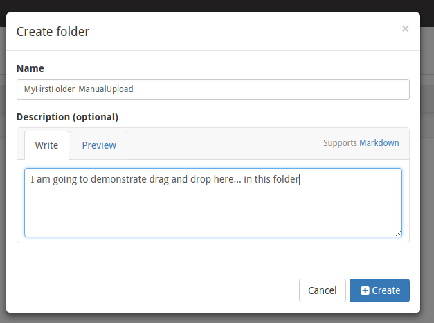

# Adding data to the DSA

### Drag and Drop

The easiest (although not the preferred) way to load files (including slides) is to do it through the UI.  

1.  Create/identify a collectoin you want to upload the slides into.

I clicked the Create Collection button, that then pops up a window to type in a name and optional description.

I am then going to create a folder to put some images into...

If you click on the upper right hand corner after you have gone to the Sample Collection you just created, you can click in the right corner and then hit "Create folder here"

To navigate here, I click on Collections on the Left Side, then Sample Collection,  and finally MyFirstFolder_ManualUpload

Now to add some file(s), I then just click the green icon on the upper right part of the screen and a window opens up where I can just drag a file onto it.  This can be done from the desktop, or Windows Explorer or nautilus (in linux).  

So here I am dragging 1009252.svs onto the green "drop files here" icon

I then click the Start Upload Button and you can also see it updates and says what file(s) I have selected for upload.

Once I hit start, it will then start uploading..

and then when it's done voila, the file now appears in the sample collection folder, and you can now even see a thumbnail of the WSI image.

If you then click on the item, it opens up a zoomable version if you want to see the image in more detail.

