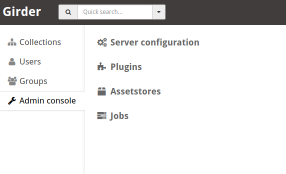
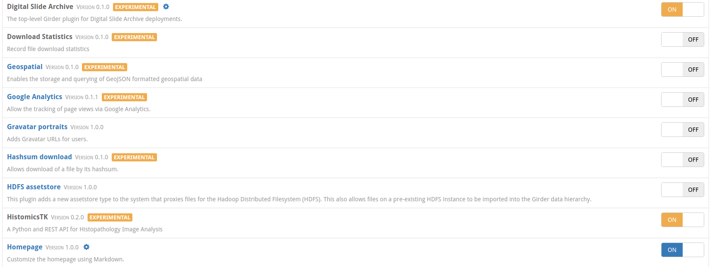
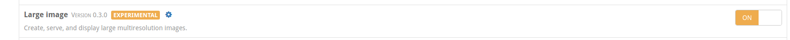
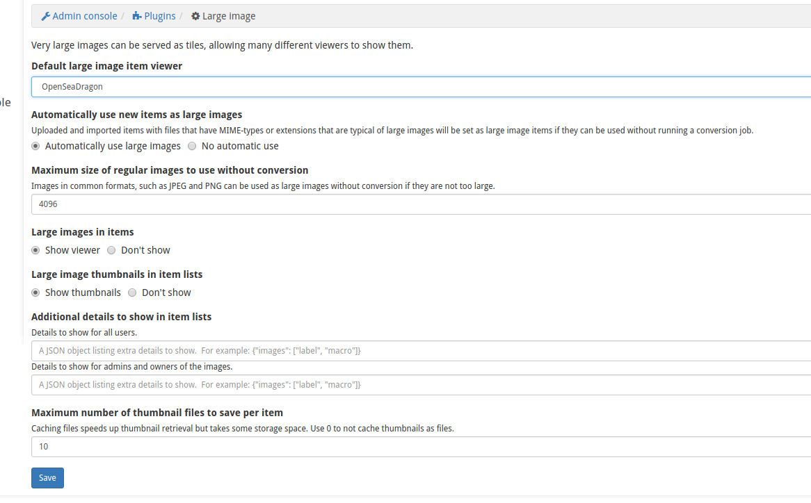
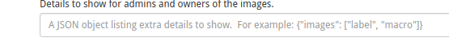

## Plugins explained..

The Digital Slide Archive (DSA) is the whole slide management tool that is built on top of Girder.  
Girder provides an API, object management, permissions and many other useful features.   The DSA and HistomicsTK are plugins that sit on top of Girder.  The most important capability the DSA plugin allows is support for large images (e.g. digital microscopy slides).  We can view Whole Slide Images (WSI) by enabling this plugin, and in the build process we went through, it's enabled by default.  In addition, the HistomimcsTK plugin allows processing of whole slide images, and is described elsewhere.

Girder has a number of other useful plugins that we can enable/disable through the admin console.  To get started, click on Admin console and then Plugins.

The large Image plugin is also helpful, and is what allows us to view large images, and also provides an API so we can grab regions within these images..

#Enabling visualization of macro and label images

If you click the cogwheel icon on largeImage, you can change some of the default behaviors.  Perhaps most useful is the ability to allow admin users to view these images directly in the web application.  This is useful for renaming slides; however this assumes that the slide labels do not contain any protected information.  **BE CAREFUL TO NOT EXPOSE PHI IF YOU ARE NOT SURE THERE MAY BE SOME SCRIBBLED ON THE SLIDE LABEL**

By typing {"images": ["label","macro"]} into the "Additional details" box, you can allow the label and macroImage that are captured by most slide scanners to be displayed in the browser.
