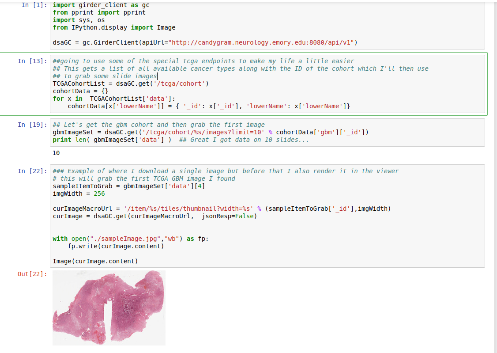

# digitalslidearchive.info
This contains documentation for installation and maintenance for the DSA, Girder and HistomicsTK

## Grabbing a thumbnail for a Girder Image

The DSA provides a number of ways to access thumbnails and regions from the
Whole Slide Image (WSI) using the API.  There is a set of convenience functions
called girder_client that wraps the REST based API and makes it into more
python friendly function calls.

If girder_client is not installed, you need to do

    pip install girder_client

There's an accompanying Jupyter notebook that provides this, just don't forget to run Jupyter client.
