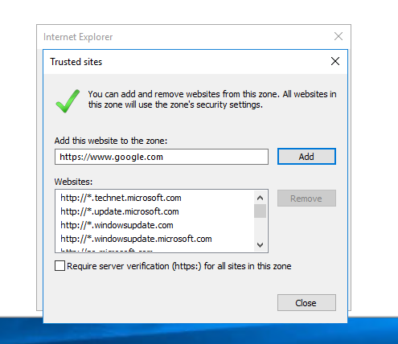
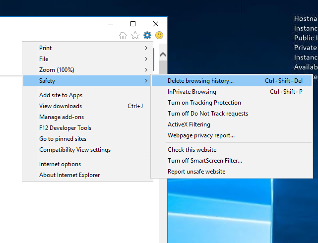

## I have set up an EC2 instance using t2.large and Windows Server 2016

The instructions are based on this, but with some additional images.

https://github.com/DigitalSlideArchive/digital_slide_archive/blob/master/ansible/README.rst

...

## First snag in AWS

I need to adjust my security settings so I can download the file!

## Adding Trusted Sites

https://www.top-password.com/blog/server-2016-your-current-security-settings-do-not-allow-this-file-to-be-downloaded/

## Click on the gear icon and you can adjust security settingsunder Internet Options

I found this fairly confusing, so I enabled download for the "internet" zone and then just installed Google Chrome!

https://google.com/chrome/

Installing Git, which I downloaded via chrome to make life easier.

## Installing VirtualBox

## Installing Vagrant

## Clone the repo via Git Bash

There are multiple ways to grab the DSA repo, but I'll demonstrate just cloning via the GIT commandline tool

Once you've started the 'Git Bash' terminal, type
   
    git clone https://github.com/DigitalSlideArchive/digital_slide_archive.git

    cd digital_slide_archive

    vagrant up

## Vagrant up command will then download the virtual machines, code, etc..

