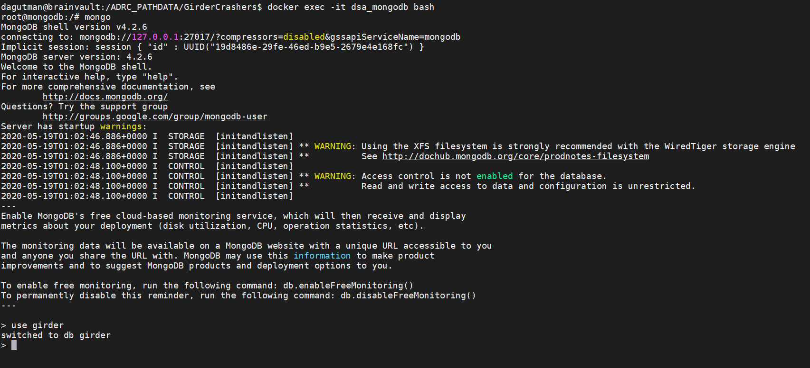

### Beware ye who enter here

So it is possible to directly modify/add indexes to the underlying mongo database.  For example, I noted slow performance when I was deleting a LOT of files (100,000+ items).  Adding an index can speed things up... however remember adding indexes also adds overhead.  So if adding an index to speed up an operationg that is a one off results in slowing down your instance for everything... there's obviously tradeoffs.  That being said, Mongo is pretty quick!

So to access the mongoDB container, assuming your connecting via console to the server running the containers.

    docker exec -it dsa_mongodb bash

So from the prompt, I am connecting to the mongoDB container and will be at a bash terminal.

So I am connecting to the container, starting the mongo client within the actual docker container, and finally <i>using</i> the <b>girder</b> database.  This allows me to now run commands directly against the underlying mongo database.  Again.... BEWARE.  

## INDEXES TO SPEED UP DELETE PERFORMANCE

db.upload.createIndex({'parentId': 1})
db.item.createIndex({'attachedToId': 1})

