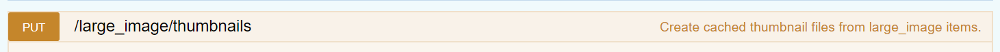
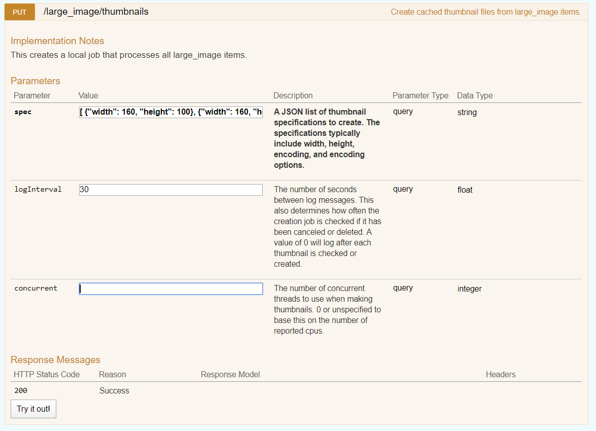
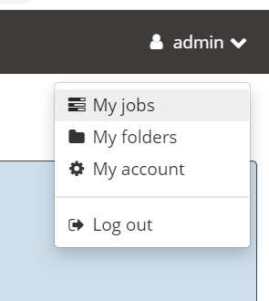
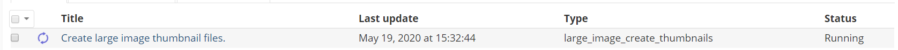
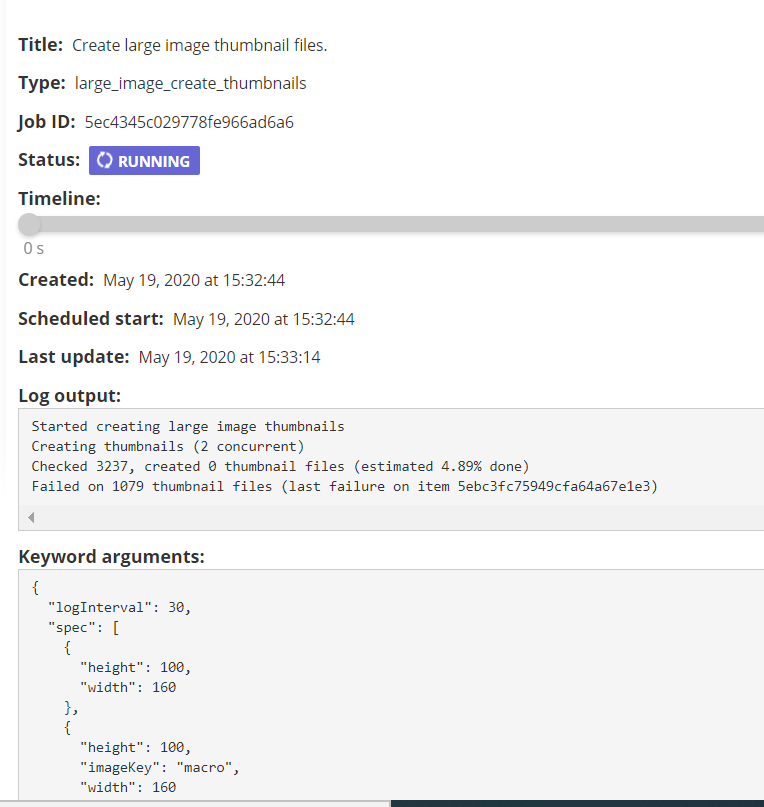

## Pregenerate thumbnails

Most of the time, users will be browsing thumbnails, so it can make things <i>MUCH</i> more efficient if the thumbnails are pregenerated.  Otherwise, you may be opening many large files all at once.  While we don't have to read the entire file contents, it can slow things down considerably when you suddenly open a ton of files.  

Fortunately, built into the API is the ability to pregenerate/cache them.  

The endpoint should be at:

https://girderserver/api/v1    This may by :8080/api/v1 or /girder/api/v1 depending on if/how you configured NGINX.

### Example Specification

    [ {"width": 160, "height": 100}, {"width": 160, "height": 100, "imageKey": "macro"}, {"width": 160, "height": 100, "imageKey": "label"},    {       "height": 100,       "width": 100     }   ]

### Monitoring Thumbnail Cacheing

Since this is submitted to Girder as a job, you can go to the UI and Under Admin->Jobs  (or your username...)

Once you click on the job, you should see:

Which should then show additional job details.

You may note some "failed" thumbnails.  This can occur if either the largeImage plugin can't read the file, or if the file has been moved from where girder things it is.  Check with your admin on these.  Or if your the admin, you can inspect some of the item ID's that are dumped in the output window and see if the file is still there.